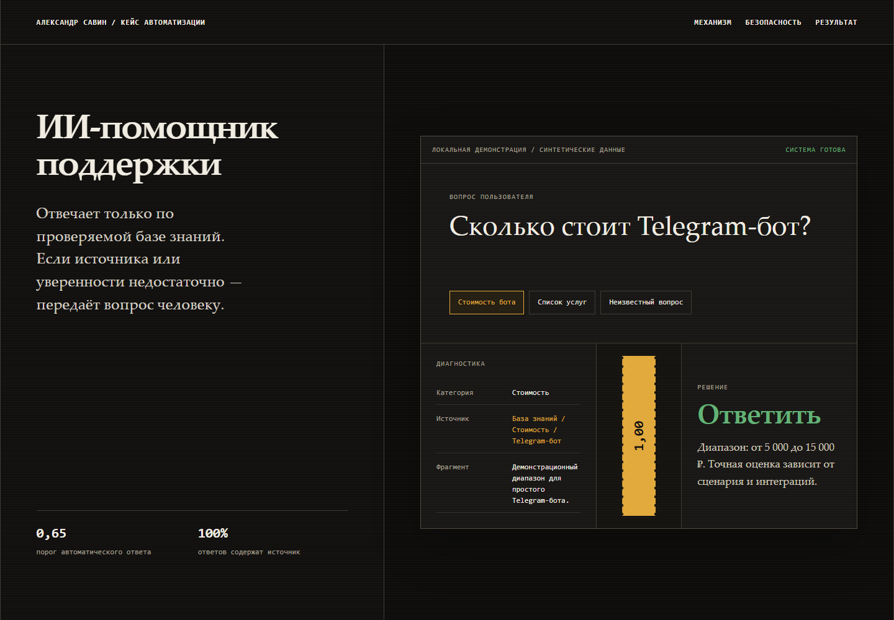

# AI Support Bot

Практический Telegram-бот поддержки: отвечает только по локальной базе знаний, показывает источник и уровень уверенности, а при значении ниже `0.65` передаёт вопрос человеку.

**[Открыть интерактивный HTML‑кейс](https://alextander28.github.io/ai-support-bot/)**



## Что демонстрирует

- классификацию вопросов по категориям;
- поиск по проверяемой базе знаний;
- безопасный маршрут: автоответ или передача человеку;
- журнал SQLite и статистику;
- опциональный классификатор через совместимый API, который не создаёт ответы вне базы;
- автономный HTML-кейс и тесты без сетевых запросов.

Все имена, вопросы, цены и сроки в демонстрации синтетические и не являются коммерческим предложением.

## Локальная демонстрация

```powershell
py -3.13 -m venv .venv
.venv\Scripts\python.exe -m pip install -r requirements.txt
.venv\Scripts\python.exe -m app.demo --reset
.venv\Scripts\python.exe -m pytest -q
```

Откройте `index.html` или `case-study.html` двойным кликом — сервер не нужен.

## Реальный Telegram-запуск

1. Скопируйте `.env.example` в `.env`.
2. Заполните `BOT_TOKEN`, `MANAGER_CHAT_ID` и `MANAGER_IDS`.
3. При необходимости добавьте `LLM_API_KEY`; без него используется локальный классификатор.
4. Запустите `.venv\Scripts\python.exe -m app.bot`.

Менеджер видит очередь через `/handoffs`, статистику через `/stats` и закрывает обращение командой `/resolve номер комментарий`.

Секреты не должны попадать в Git или HTML.
